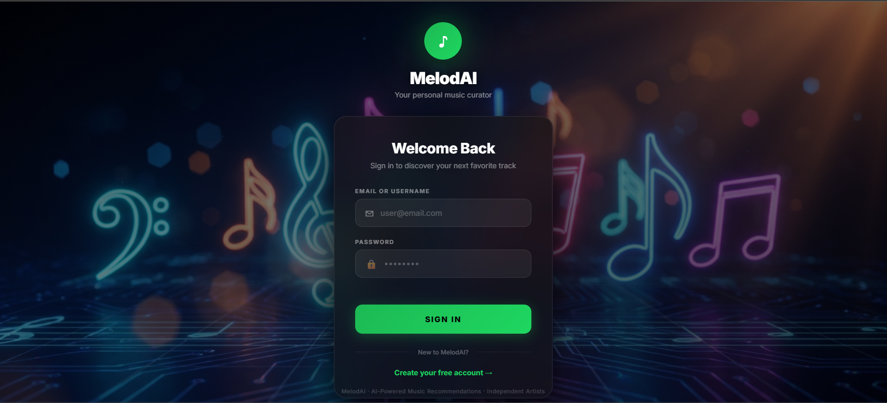

<div align="center">

# 🎵 MelodAI

### *AI-Powered Music Recommendation Platform*

<p align="center">
  
</p>

[](https://python.org)
[](https://flask.palletsprojects.com)
[](https://scikit-learn.org)
[](https://sqlite.org)
[](https://www.chartjs.org)
[](LICENSE)

---

A **hybrid, real-time music platform** that blends content-based vector similarity with dynamic popularity scoring, enriched by live tagging and audio previews. Features a full **role-based multi-user system** with **Admin**, **Artist**, and **User** roles, AI-powered personalization, artist monetization, and an interactive analytics dashboard.

</div>

---

## ✨ Features

### 🤖 AI Recommendations
- **Hybrid Scoring** — Cosine similarity + popularity with tunable alpha slider
- **Live Feedback Loop** — Like, Play, and Skip actions reshape your profile in real time
- **Cold Start Eliminated** — Onboarding genre & artist preferences seed your profile instantly
- **Followed Artist Boost** — Songs from artists you follow get a score bump
- **Collaborative Filtering** — Similar users influence your recommendations subtly
- **Explanation Tags** — Each card shows *"Because you follow [Artist]"* or *"Trending in [Genre]"*

### 👥 Role System

| Role | Access | Dashboard |
|------|--------|-----------|
| 🔴 **Admin** | Full platform control | Tableau-style analytics, user/artist/content management |
| 🟡 **Artist** | Upload & monetize | Per-track analytics, earnings, follower growth |
| 🟢 **User** | Personalized experience | AI recommendations, playlists, follows, profile |

### 🎤 Artist Tools
- Upload MP3/WAV with auto audio feature extraction (librosa)
- Manage albums, profile, and cover art
- Real-time earnings tracker ($0.004/play, $0.010/like)

### 📊 Analytics
- **Admin**: User growth, top songs, revenue, genre distribution, activity feed
- **Artist**: Play counts, likes, follower growth, monthly earnings trends

---

## 🖼️ Screenshots

### User Experience
<p float="left">
  
  
</p>
<p float="left">
  
  
</p>

### Admin Panel
<p float="left">
  
  
</p>
<p float="left">
  
  
</p>

### Artist Dashboard
<p float="left">
  
  
</p>
<p float="left">
  
  
  
</p>

---

## 🏗️ Architecture

```
┌──────────────────────────────────────────────────────────────┐
│                         Browser                              │
│               (Dark Glassmorphism Theme)                      │
└────────────────────────┬─────────────────────────────────────┘
                         │ HTTP
┌────────────────────────▼─────────────────────────────────────┐
│                    Flask Web Server                            │
│  Core: /, /login, /register, /onboarding, /search            │
│  Blueprints: /admin/*, /artist/*, /user/*, /api/*            │
│  Middleware: Role-based access control                        │
└──────┬──────────────────┬──────────────────┬─────────────────┘
       │                  │                  │
┌──────▼──────┐  ┌────────▼────────┐  ┌─────▼─────────────────┐
│ Recommender │  │   SQLite DB     │  │   External APIs       │
│ Engine      │  │  (events.db)    │  │  • iTunes Search      │
│ (numpy/     │  │                 │  │  • Last.fm Tags       │
│  scipy +    │  │  users          │  │  • SMTP (invites)     │
│  librosa)   │  │  artists        │  └───────────────────────┘
│             │  │  songs_uploaded │
│ • Cosine    │  │  playlists      │  ┌───────────────────────┐
│ • Collab    │  │  events         │  │   File Storage        │
│ • Boost β   │  │  earnings_log   │  │  uploads/songs/       │
│ • Profile   │  │  notifications  │  │  uploads/covers/      │
│   Vector    │  └─────────────────┘  │  uploads/profiles/    │
└─────────────┘                       └───────────────────────┘
```

---

## 🛠️ Tech Stack

| Layer | Technology |
|-------|-----------|
| **Backend** | Python 3.11+, Flask, Flask Blueprints |
| **Auth** | Werkzeug (password hashing), Flask sessions |
| **Recommender** | NumPy, SciPy, scikit-learn |
| **Audio Analysis** | librosa (feature extraction) |
| **Data** | Pandas, PyArrow, SQLite |
| **Email** | smtplib + email.mime |
| **Frontend** | Jinja2, HTML5/CSS3, Vanilla JS |
| **Charts** | Chart.js |
| **File Uploads** | Werkzeug secure handling |

---

## 🚀 Quick Start

### Prerequisites
- Python **3.9+**
- pip

### Setup

```bash
# 1. Install dependencies
pip install -r requirements.txt

# 2. Configure environment
# Copy these to .env (see .env.example):
#   LASTFM_API_KEY, FLASK_SECRET_KEY, SMTP_*,
#   ADMIN_USERNAME, ADMIN_EMAIL, ADMIN_PASSWORD

# 3. Initialize database
python app.py --init-db

# 4. Run the server
python app.py
```

The app starts at **http://127.0.0.1:5000**.

### First-Run Flow
1. Register as a **User** at `/register` → complete onboarding
2. **Admin** logs in at `/login` → manages platform at `/admin/dashboard`
3. **Admin** adds artists → invite codes are generated & emailed
4. **Artists** register with invite code → upload music → track earnings

---

## 🔗 API Endpoints

| Method | Route | Description |
|--------|-------|-------------|
| `GET` | `/` | AI Recommendation page |
| `GET/POST` | `/login` | User login |
| `GET/POST` | `/register` | User registration |
| `GET/POST` | `/onboarding` | Genre & artist preference setup |
| `GET` | `/search` | Global search |
| `GET` | `/health` | Platform health check |

### Blueprint Routes
- **`/admin/*`** — Dashboard, user/artist management, add artist
- **`/artist/*`** — Dashboard, upload, albums, profile, earnings
- **`/user/*`** — Profile, playlists, follows
- **`/api/*`** — JSON endpoints for recommendations, analytics, notifications

---

## 💰 Earnings Model

| Event | Rate |
|-------|------|
| ▶️ Play | $0.004 |
| ❤️ Like | $0.010 |
| ⏭️ Skip | $0.000 |

---

## 📁 Project Structure

```
├── app.py                    # Flask app — core routes, startup
├── auth.py                   # Auth system & role middleware
├── recommender.py            # AI recommendation engine
├── earnings.py               # Earnings calculation
├── mailer.py                 # SMTP email service
├── mood.py                   # Mood detection
├── genre_classifier.py       # Genre classification
├── cover_gen.py              # AI cover generation
├── scheduler.py              # Background task scheduler
├── .env                      # Environment variables
├── events.db                 # SQLite database
│
├── routes/
│   ├── admin.py              # Admin panel routes
│   ├── artist.py             # Artist dashboard routes
│   ├── user.py               # User profile routes
│   └── api.py                # JSON API endpoints
│
├── artifacts/                # ML model artifacts
├── data/                     # Dataset files
├── uploads/                  # User uploads
├── templates/                # Jinja2 HTML templates
├── static/                   # CSS, JS, images
└── img/                      # Screenshots for README
```

---

## 📸 Screenshots Directory

All screenshots are in the [`img/`](./img/) folder:

| File | Description |
|------|-------------|
| `login.png` | Login page with dark glassmorphism theme |
| `user dashboard.png` | AI recommendation page |
| `user dashboard while song playing.png` | Recommendations with active audio player |
| `user setting.png` | User profile & settings |
| `ai chat bot.png` | AI assistant chat interface |
| `admin dashboard.png` | Admin analytics dashboard |
| `add new artist.png` | Add artist form |
| `admin gbobal broadcast.png` | Broadcast message to users |
| `maillog admin.png` | Email log viewer |
| `artist dashboard.png` | Artist earnings & analytics |
| `upload song artist.png` | Song upload form |
| `create album.png` | Album creation |
| `edit profile artist.png` | Artist profile editor |
| `make announcement artist.png` | Artist announcements |

---

## 📄 License

This project is licensed under the MIT License.

---

<div align="center">

**Built with ❤️ using Flask, scikit-learn, and Chart.js**

[Report Bug](https://github.com/A030708/MelodAI/issues) · [Request Feature](https://github.com/A030708/MelodAI/issues)

</div>
